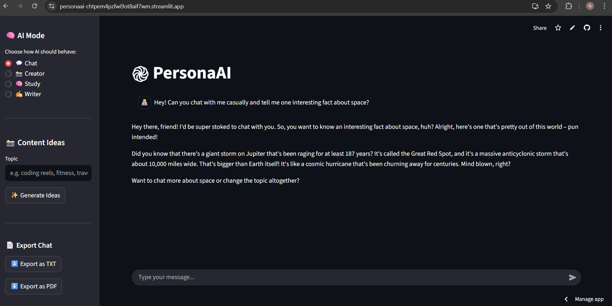
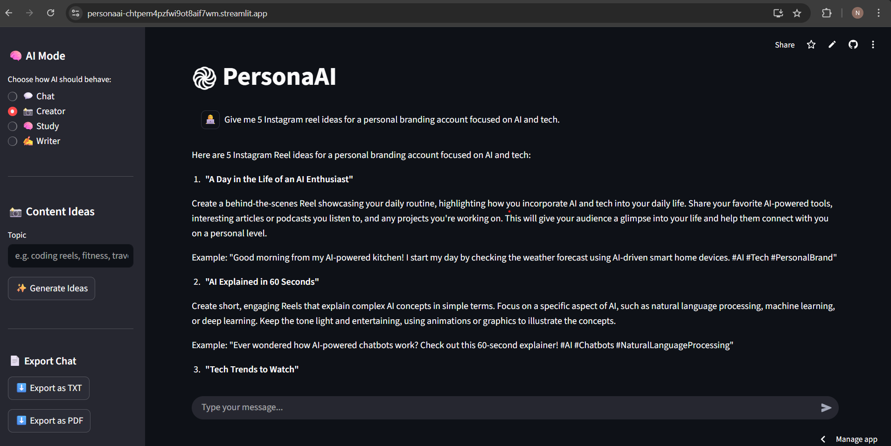
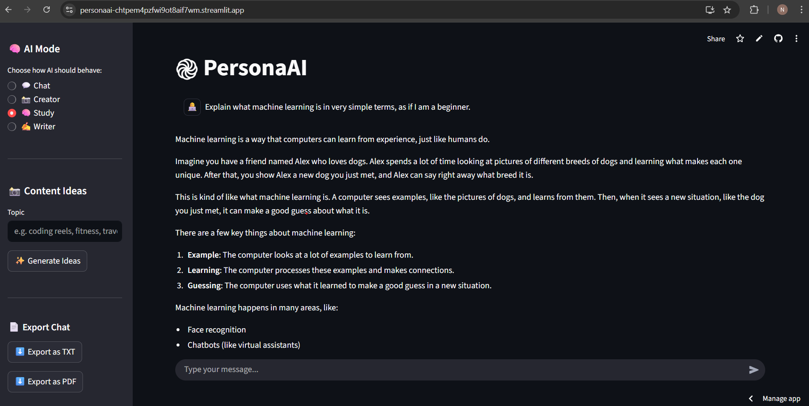
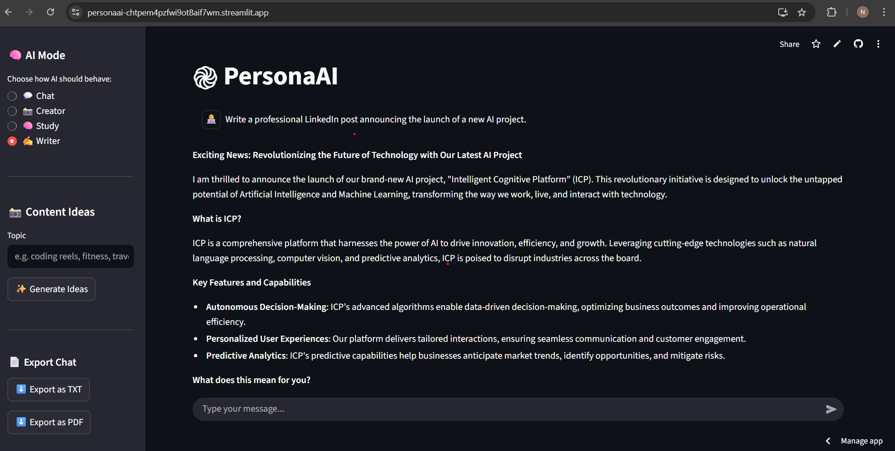
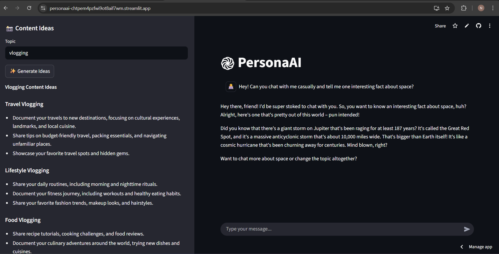

# PersonaAI - A Multi-Mode AI Assistant Built with Streamlit

PersonaAI is a multi-mode AI assistant that dynamically adapts its responses based on user intent.
It offers distinct AI personas for chatting, content creation, studying, and writing — all within a single, intuitive web interface.
The project focuses on practical AI usability, clean UI design, and real-world features such as chat export, summaries, and session control.

🔗 Live Demo
👉 https://personaai-mhhq6b5a3cukomav8qzt4c.streamlit.app/

---

## Application Preview
Chat Mode

Creator Mode

Study Mode

Writer Mode

Content Ideas

---

## Key Features
## Multi-Mode AI Interaction : 
💬 Chat Mode – Friendly, casual conversations for general use
📸 Creator Mode – Generates social media content ideas and creative suggestions
🧠 Study Mode – Explains concepts in a simple, beginner-friendly manner
✍️ Writer Mode – Assists with professional and structured writing
Each mode maintains its own conversation memory, ensuring context-aware and relevant responses.

## Conversation Management :
- Export as TXT – Download chat history in text format
- Export as PDF – Download chat history as a well-formatted PDF
- Auto Summary – AI-generated summary highlighting key discussion points
- Clear Chat – Instantly resets the conversation for the selected mode

## User Experience :
- Clean and responsive Streamlit UI
- Sidebar-based controls for:
- Mode selection
- Export options
- Auto summary
- Chat reset

---
## Tech Stack
- Python – Core programming language
- Streamlit – Interactive web UI and app framework
- Groq API (LLaMA 3.1 models) – High-performance LLM inference
- OpenAI Python SDK – Client interface for LLM requests (Groq-compatible)
- python-dotenv – Secure environment variable management
- ReportLab – PDF generation for chat export
- BytesIO (in-memory streams) – File handling for downloads
- Textwrap – Clean text formatting for PDF rendering

---

## Project Structure
PersonaAI/
├── app.py              # Main Streamlit application
├── requirements.txt    # Project dependencies
├── README.md           # Project documentation
└── .env                # API keys (excluded from version control)

---

## Design Decisions
- Multi-Mode Architecture
    - Single LLM reused across multiple personas using mode-specific system prompts
    - Reduces duplication and demonstrates effective prompt engineering
- Mode-Specific Memory
    - Separate conversation history maintained per mode using Streamlit session state
    - Prevents context mixing and improves response relevance
- Sidebar-First UI Design
    - All controls placed in the sidebar:
        - Mode selection
        - Export options
        - Summary generation
        - Clear chat
    - Keeps the main chat interface clean and distraction-free
- Conversation Export & Summarization
    - Supports exporting chats as TXT and PDF
    - AI-generated summaries enable quick review and documentation
- Clear Chat Control
    - Resets conversation per mode without affecting others
    - Gives users full control over context
- Readable & Maintainable Code Structure
    - Simple, modular logic prioritized over heavy abstraction
    - Easy to understand, debug, and extend
- Secure & Deployment-Ready Setup
    - Environment variables handled via .env
    - Structured for smooth deployment on Streamlit Cloud
- Product-Focused Design Philosophy
    - Built to reflect real-world AI application design
    - Emphasis on usability, clarity, and interaction flow
